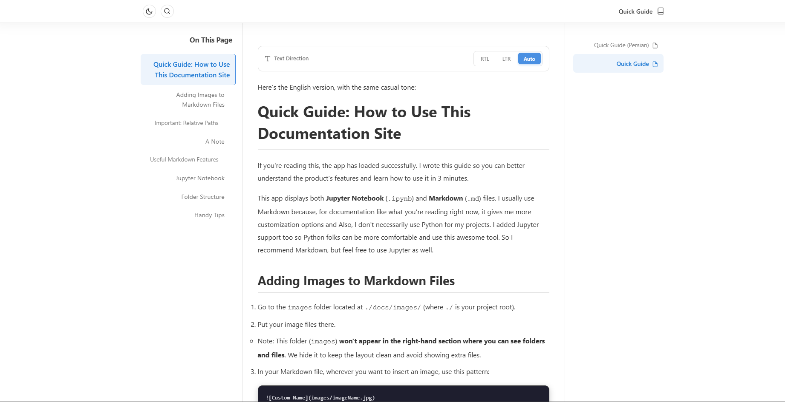
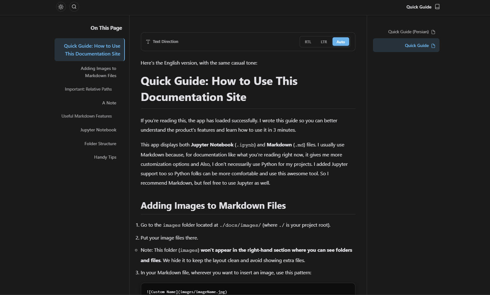

# DocSite

An awesome and easy way to build your project's documentation using **Markdown** and **Jupyter Notebook**.

## Project Look

**Light Mode**  



**Dark Mode**  



> **Note:** Place your screenshot images in `docs/images/` and update the paths above.

## Features

- Supports both Markdown (`.md`) and Jupyter Notebook (`.ipynb`) files
- Clean, responsive design for desktop, tablet, and mobile
- Dark and light theme toggle
- Full-text search across all documents
- RTL / LTR / Auto text direction
- Local image support
- Table of contents with scroll spy
- Syntax highlighting and copy button for code blocks

## Installation Guide

1. **Install Node.js**  
   Download and install from [https://nodejs.org](https://nodejs.org/en).

2. **Install dependencies**  
   In the project root folder (where `package.json` is located), run:
   ```bash
   npm install
   ```

3. **Start the server**  
   After installation completes, run:
   ```bash
   node server.js
   ```

4. **Open in browser**  
   You should see:
   ```
   Documentation server running at http://localhost:3000
   ```
   Copy `http://localhost:3000` and paste it into your browser. You'll see the Quick Guide right away. Enjoy!

## Adding Your Own Documents

- Place your `.md` or `.ipynb` files inside the `docs` folder.
- You can organize them in subfolders, they'll appear as collapsible sections in the sidebar.
- The first file (usually `index.md`) will be your home page.

## Quick Guide

A full **Quick Guide** is included in the docs folder. It covers:
- How to add images
- Tips for writing documentation