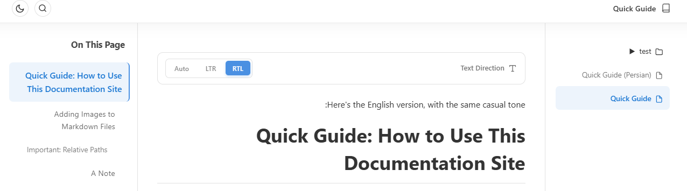

# راهنمای سریع: چطور از این سایت مستندات استفاده کنی

اگر داری این را می‌خوانی، یعنی وب‌اپ با موفقیت لود شده. این راهنما رو نوشتم تا بتونی ویژگی‌های محصول رو بهتر متوجه بشی و توی ۳ دقیقه کار باهاش رو یاد بگیری.

این اپ هم فایل‌های **Jupyter Notebook** (`.ipynb`) و هم **Markdown** (`.md`) را نمایش می‌دهد. من معمولاً از Markdown استفاده می‌کنم چون برای مستندسازی مثل همین که داری می‌خونی، قابلیت‌های شخصی‌سازی بیشتری بهم می‌ده. از طرفی چون لزوماً برای پروژه‌هام فقط از پایتون استفاده نمی‌کنم و نمی‌خوام استفاده از یک زبان خاص باعث بشه کسی نتونه متنم رو بخونه، پشتیبانی از Jupyter رو هم اضافه کردم تا پایتون‌کارها راحت‌تر باشن و بتونن از این ابزار فوق‌العاده استفاده کنن. پس Markdown رو توصیه می‌کنم، اما راحت باش و از Jupyter هم استفاده کن.

## اضافه کردن تصاویر به فایل‌های Markdown

1. برو به پوشهٔ `images` که در `./docs/images/` قرار دارد (که `./` ریشهٔ پروژهٔ توست).
2. فایل‌های تصویرت را آنجا بگذار.
   - نکته: این پوشه (`images`) **در ناوبری وب‌اپ نمایش داده نمی‌شود**. ما مخفی‌اش می‌کنیم تا چیدمان تمیز بماند و فایل‌های اضافی نشان داده نشوند.
3. در فایل Markdown خودت، هر جا می‌خواهی تصویر را وارد کنی، از این الگو استفاده کن:

```markdown

```

می‌توانی از PNG، JPG، JPEG و بقیه فرمت‌های رایج تصویر استفاده کنی—این فقط یک مثال بود.

مثلاً، من یک اسکرین‌شات اینجا گذاشتم:



### مهم: مسیرهای نسبی

اگر فایل Markdown تو در یک زیرپوشه است، مسیر تصویر باید نسبت به همان فایل Markdown باشد. برای مثال:

- Markdown at `docs/guide.md` → image at `docs/images/photo.png` → use `images/photo.png`
- Markdown at `docs/sub/guide.md` → image at `docs/sub/images/photo.png` → use `images/photo.png`
- Markdown at `docs/sub/guide.md` → image at `docs/images/photo.png` → use `../images/photo.png`

## یک نکته

لازم نیست توی نوشتن Markdown حرفه‌ای باشی. این روزها ابزارهای AI اغلب به‌صورت پیش‌فرض Markdown خروجی می‌دهند. می‌توانی متنت را بنویسی، در یک فایل `.md` پیست کنی، و فقط یادت باشد از الگوی تصویری که بالا نشان داده شد استفاده کنی.
حتی دکمهٔ کپی در چت‌های AI هم Markdown به تو می‌دهد—پس بله، خوش بگذران!

### قابلیت‌های مفید Markdown

- **سرتیترها**: از `#`، `##`، `###` و غیره استفاده کن. اپ به‌صورت خودکار از سرتیترهایت یک فهرست "On This Page" می‌سازد.
- **بلوک‌های کد**: از سه بک‌تیک با نام زبان برای هایلایت سینتکس و دکمهٔ کپی استفاده کن.
- **جدول‌ها**: جدول‌های استاندارد Markdown پشتیبانی می‌شوند.
- **لیست‌ها**: هم لیست‌های شماره‌دار و هم بدون شماره کار می‌کنند.

## Jupyter Notebook

می‌توانی فایل‌های `.ipynb` را هم به پوشهٔ `docs` اضافه کنی. آن‌ها این‌طور رندر می‌شوند:
- سلول‌های Markdown به‌صورت HTML
- سلول‌های کد با هایلایت سینتکس
- خروجی‌ها (متن، تصاویر، خطاها) زیر هر سلول نمایش داده می‌شوند

## ساختار پوشه‌ها

همهٔ مستنداتت را داخل پوشهٔ `docs` بگذار. می‌توانی زیرپوشه بسازی—آن‌ها به‌صورت بخش‌های تاشو در سایدبار ظاهر می‌شوند.

مثال:

```
docs/
├── index.md
├── images/
│   └── logo.png
├── guide.md
└── api/
    ├── auth.md
    └── endpoints.md
```

## نکات کاربردی

- **جست‌وجو**: روی دکمهٔ جست‌وجو کلیک کن (یا `Ctrl+K` را بزن) تا بین همهٔ مستندات جست‌وجو کنی. نتایج یک پیش‌نمایش نشان می‌دهند و مستقیم به خط مطابق لینک می‌شوند.
- **تغییر جهت نوشته‌ها:** با کلیدهای بالای هر نوشته (که احتمالاً اول می‌بینی‌اش) می‌تونی جهت متن‌هات رو تغییر بدی. برای متن‌های فارسی پیشنهاد می‌شه Auto رو روی RTL بگذاری تا حتی اگر با انگلیسی شروع کردی، راست‌چین بمونه.
- **تم تاریک/روشن**: تم را با دکمهٔ نوار بالا عوض کن.
- **واکنش‌گرا**: روی موبایل، تبلت و دسکتاپ کار می‌کند. روی موبایل، از منوی همبرگری برای ناوبری و از دکمهٔ شناور برای "On This Page" استفاده کن.
- **پوشه‌های مخفی**: پوشه‌های `images`، `assets`، `img`، `static` و `node_modules` از ناوبری مخفی هستند تا همه‌چیز تمیز بماند.

تمام! از نوشتن مستنداتت لذت ببر.